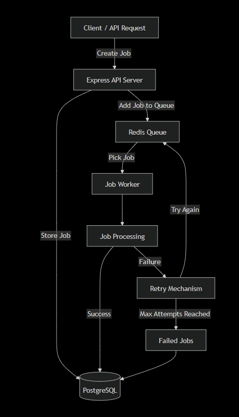

# Distributed Job Queue System

A backend project built to understand how applications handle heavy or time-consuming tasks in the background using job queues and workers.

## Why I am building this

In a normal backend application, some tasks can take a lot of time, such as:

- Sending emails
- Processing images or videos
- Generating reports
- Sending notifications
- Running AI/ML processing
- Processing large amounts of data

If the API performs these tasks directly, the user may have to wait for the operation to finish.

A job queue allows the API to create a job and return a response quickly, while a background worker processes the actual task separately.

## Basic Flow

```text
Client
   ↓
Express API
   ↓
Create Job
   ↓
PostgreSQL
   ↓
Redis Queue
   ↓
Worker
   ↓
Process Job



//Now flow
            
            
            Express API
                  |
                  v
             PostgreSQL
                  |
                  v
              BullMQ
                  |
                  v
                Redis
                  |
                  v
               Worker
                  |
          ┌───────┴────────┐
          |                |
       Success           Failure
          |                |
          v                v
    PostgreSQL        Retry / Backoff
                           |
                      ┌────┴────┐
                      |         |
                   Retry      Final
                      |       Failure
                      |         |
                      └────┐    v
                           └> PostgreSQL